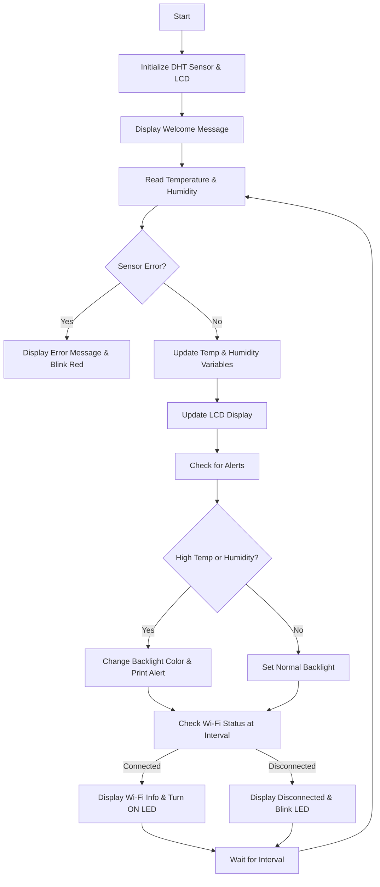

# Weather Station v2.0 - Upgraded!

Keep tabs on temperature and humidity in real-time using an ESP32, DHT sensor, and an OLED display. Check the data remotely from anywhere with Arduino IoT Cloud.

## What's New in v2.0?

*   **RGB Backlight:** The LCD now has a fancy RGB backlight that changes color to alert you about high temperature or humidity.
*   **Welcome Message:** The LCD greets you with a friendly message on startup.
*   **Error Handling:** The system now detects sensor errors and lets you know if something's wrong.
*   **Wi-Fi Status:** The LCD displays the Wi-Fi connection status and signal strength.
*   **Improved Code:** I've made the code cleaner and easier to understand.

## What You Can Use It For

*   Keep an eye on the temperature at home.
*   Automate your greenhouse.
*   Monitor industrial environments.
*   Use it in agriculture.
*   Track conditions in data centers.
*   Control heating and cooling systems.

## Stuff You'll Need

*   ESP32 development board
*   DHT11/DHT22 sensor
*   LCD display with RGB backlight (16x2 characters)
*   Breadboard and jumper wires (for prototyping)

## Software

*   Arduino IoT Cloud account
    or
*   Arduino IDE

## How to Set It Up

1.  Clone this repository: `git clone https://github.com/your-username/your-repo-name.git`
2.  Open the code in the Arduino IDE.
3.  Connect your ESP32 to your computer.
4.  Configure the Wi-Fi settings in the code.
5.  Upload the code to your ESP32.

## Diagram

[

## How It Works (Flowchart)

## Let's Get Started!

1.  Power on your ESP32.
2.  Check the LCD for the welcome message.
3.  The LCD will show the current temperature and humidity.
4.  You can also view the data on your Arduino IoT Cloud dashboard.
5.  The backlight will change color if the temperature or humidity goes above the set limits.

## Code

You can find the full code in the `code.cpp` file. It's licensed under MIT, so feel free to use and modify it.

**Happy monitoring!**
